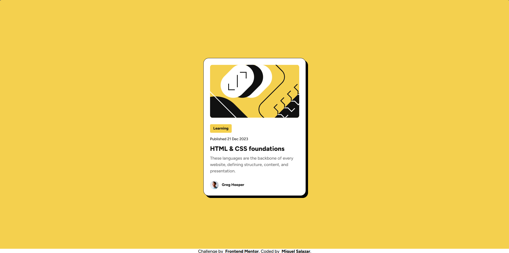
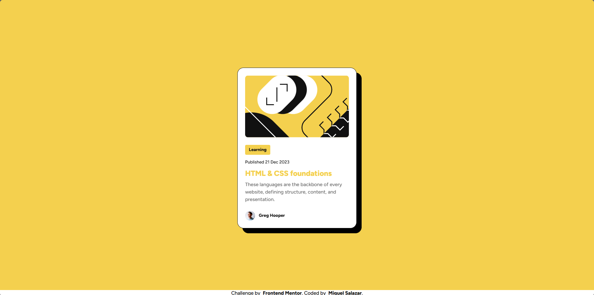
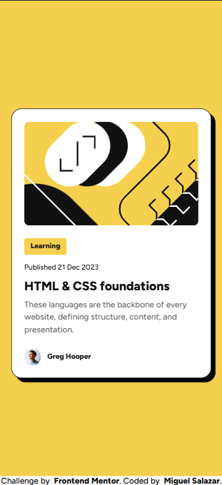
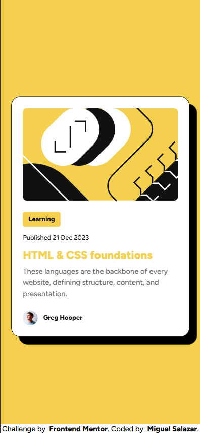

# Frontend Mentor - Blog preview card solution

This is my solution to the [Blog preview card challenge on Frontend Mentor](https://www.frontendmentor.io/challenges/blog-preview-card-ckPaj01IcS). Frontend Mentor challenges help you improve your coding skills by building realistic projects. 

## Table of contents

- [Overview](#overview)
  - [The challenge](#the-challenge)
  - [Screenshot](#screenshot)
  - [Links](#links)
- [My process](#my-process)
  - [Built with](#built-with)
  - [What I learned](#what-i-learned)
  - [Continued development](#continued-development)
  - [Useful resources](#useful-resources)
- [Author](#author)

## Overview

### The challenge

Users should be able to:

- See hover and focus states for all interactive elements on the page

### Screenshot

- Desktop Version:


- Desktop Version - Hover:


- Mobile Version:


- Mobile Version - Focus:


### Links

- Solution URL: [If you want to share some feedback, please go to my solution!](https://your-solution-url.com)
- Live Site URL: [You can view my solution live!](https://miguel-salazar-dev.github.io/blog-preview-card-main/)

## My process

### Built with

- Semantic HTML5 markup
- CSS custom properties
- Flexbox

### What I learned

It was a very good experience, the challenge to adjust the font size without depending on Media Queries into the CSS, was something that put my mind on investigate mode.

This was part of the solution for a class:

```html
<h1 class="card-title">HTML & CSS foundations</h1>
```

```css
.card-title {
  height: auto;
  margin: 0;
  font-size: clamp(20px, 2vw, var(--font-preset-1-size));
  font-weight: var(--font-preset-weight-bold);
  transition: color 0.2s;
}
```

### Continued development

I want to learn a lot more about CSS and all the frontend!

### Useful resources

- [MDN Documentation](https://developer.mozilla.org/es/) - All about CSS, HTML and Javascript in one place, kind of technical sometimes but a great source of information.

## Author

- Website - [Miguel Salazar](https://github.com/Miguel-Salazar-Dev)
- Frontend Mentor - [@Miguel-Salazar-Dev](https://www.frontendmentor.io/profile/Miguel-Salazar-Dev)